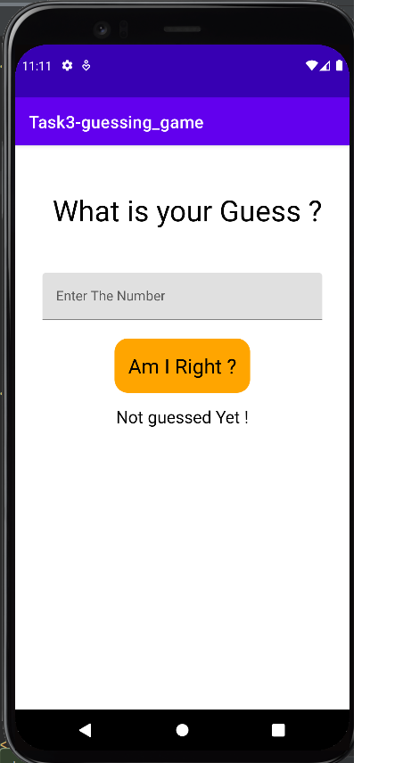
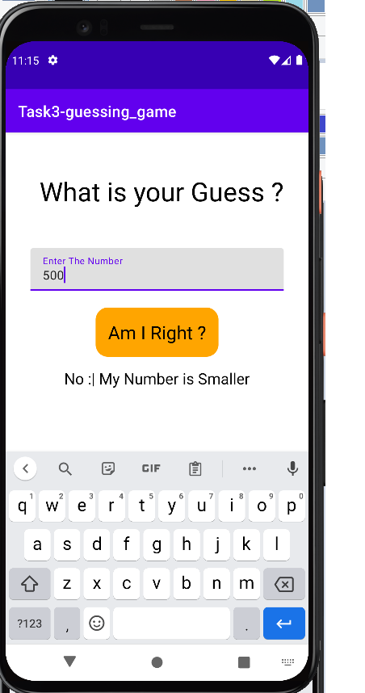
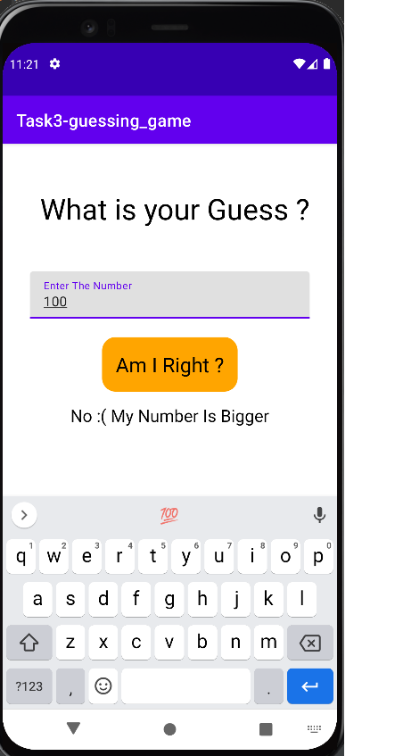
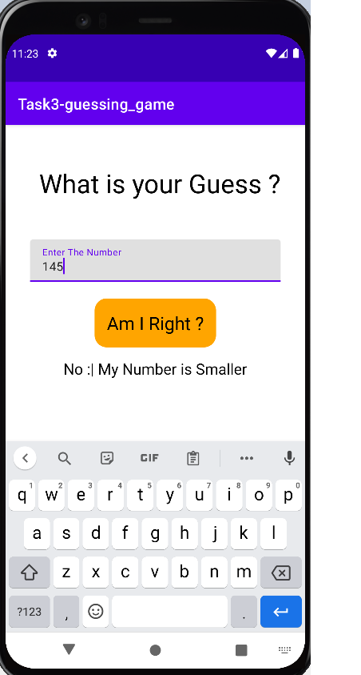
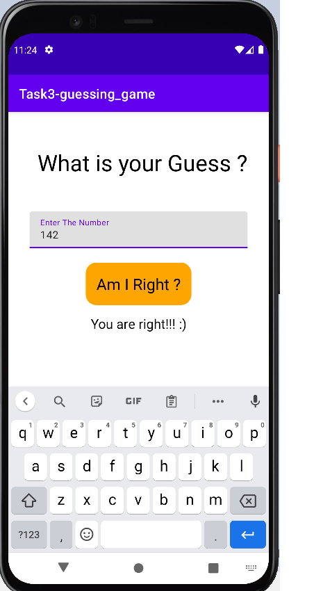

# Android-Studio---Task-3.1

<h1> Create an application that plays a guessing game with you</h1>

There's a classical guessing game: Person1 picks secret a number between 0 and 1000. Person2 tries to guess the number. If the guess fails, Person1 tells if the guessed number was bigger or smaller than the secret number.

For example.
Person1: [secretly guesses 789 and tells nothing]
Person2: is it 500?
Person1: No, my number is bigger
Person2: is it 750?
Person1: No, my number is bigger
Person2: is it 825?
Person1: No, my number is smaller
...
Person2: is it 790?
Person1: No, my number is smaller
Person2: is it 789?
Person1: Yes, you are right!

You have to write the application that works like Person1. It picks the random secret number, gives the user an ability to guess the number, and gives feedback, if the guessed number was bigger or smaller than the secret one.

 
 

 

 

 

 
